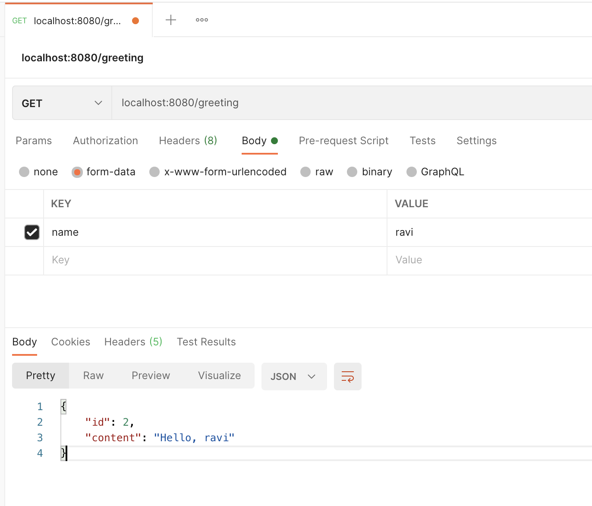

### AtomicLong
A java.util.concurrent.atomic.AtomicLong class provides operations on underlying long value that can be read and written atomically, and also contains advanced atomic operations. AtomicLong supports atomic operations on underlying long variable. It have get and set methods that work like reads and writes on volatile variables. That is, a set has a happens-before relationship with any subsequent get on the same variable. The atomic compareAndSet method also has these memory consistency features.

#### Result 

- Test in PostMan

localhost:8080/greeting

