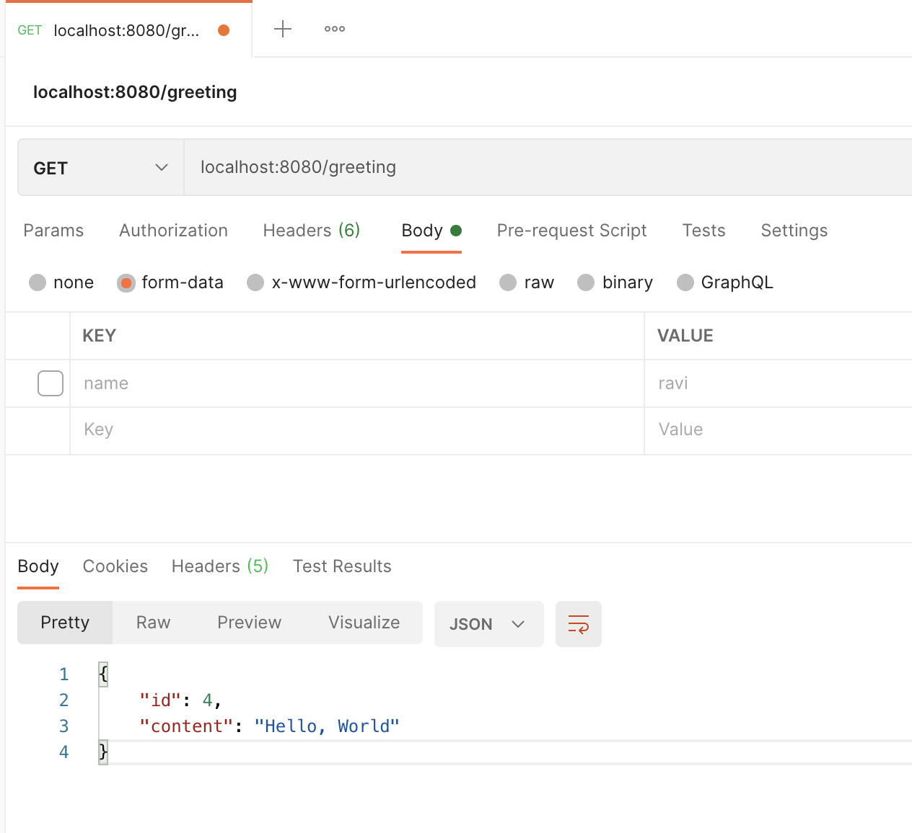

### AtomicLong
A java.util.concurrent.atomic.AtomicLong class provides operations on underlying long value that can be read and written atomically, and also contains advanced atomic operations. AtomicLong supports atomic operations on underlying long variable. It have get and set methods that work like reads and writes on volatile variables. That is, a set has a happens-before relationship with any subsequent get on the same variable. The atomic compareAndSet method also has these memory consistency features.

### @RestController
Spring 4.0 introduced the **@RestController** annotation in order to simplify the creation of RESTful web services. It's a convenient annotation that combines **@Controller** and **@ResponseBody**

### @RequestParam
we can use **@RequestParam** to extract query parameters, form parameters, and even files from the request.**@RequestParam** is a Spring annotation used to bind a web request parameter to a method parameter.

- It has the following optional elements:
  - defaultValue - used as a fallback when the request parameter is not provided or has an empty value 
  - name - name of the request parameter to bind to
  - required - tells whether the parameter is required
  - value - alias for name
----------
# Test Result

#### Test  

- Test1 in PostMan 

##### With Parameter
localhost:8080/greeting

--------------------
- Test2 in PostMan

#### Without Parameter
localhost:8080/greeting

