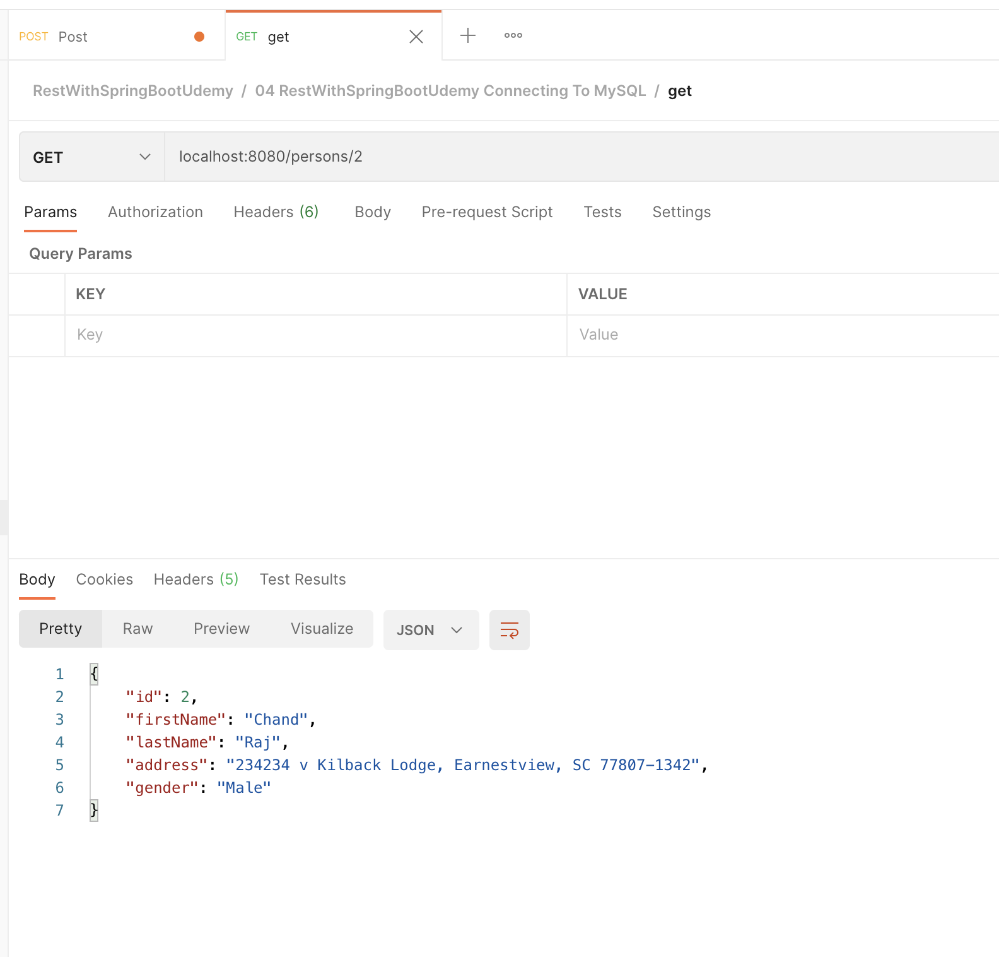
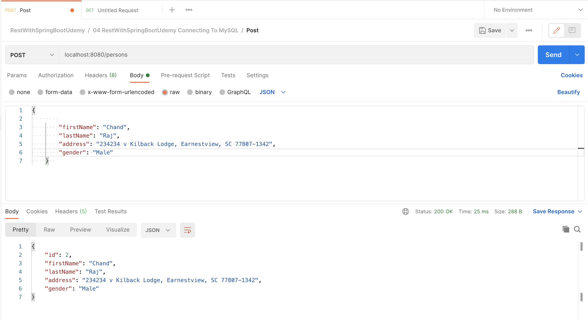
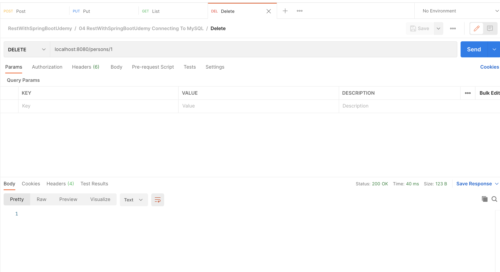

### @Repository
@Repository is a Spring annotation that indicates that the decorated class is a repository. A repository is a mechanism for encapsulating storage, retrieval, and search behavior which emulates a collection of objects. It is a specialization of the @Component annotation allowing for implementation classes to be autodetected through classpath scanning.


--------------

## Test Code

- [Get] single person
   - localhost:8080/persons/1
     

- [Get] List of persons
   - localhost:8080/persons
     
- [Post] person
    - localhost:8080/persons
      
    ``` 
   {
        "id": 3,
        "firstName": "raj",
        "lastName": "Berge",
        "address": "1431 Kilback Lodge, Earnestview, SC 77807-1342",
        "gender": "Female"
    }  
  ```

- [Put] person
    - localhost:8080/persons
      
 ``` 
   {
        "id": 3,
        "firstName": "raj",
        "lastName": "Berge",
        "address": "1431 Kilback Lodge, Earnestview, SC 77807-1342",
        "gender": "Female"
    }  
  ```

- [Delete] person
    - localhost:8080/persons
      