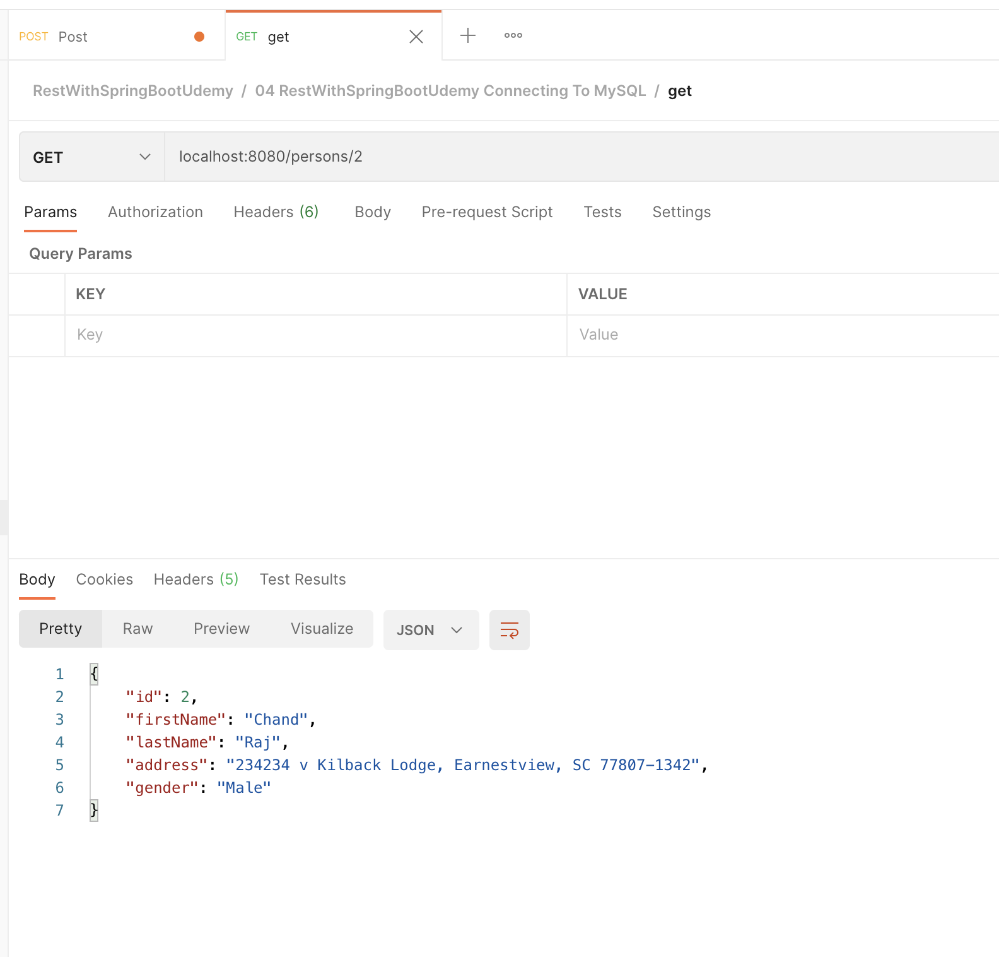
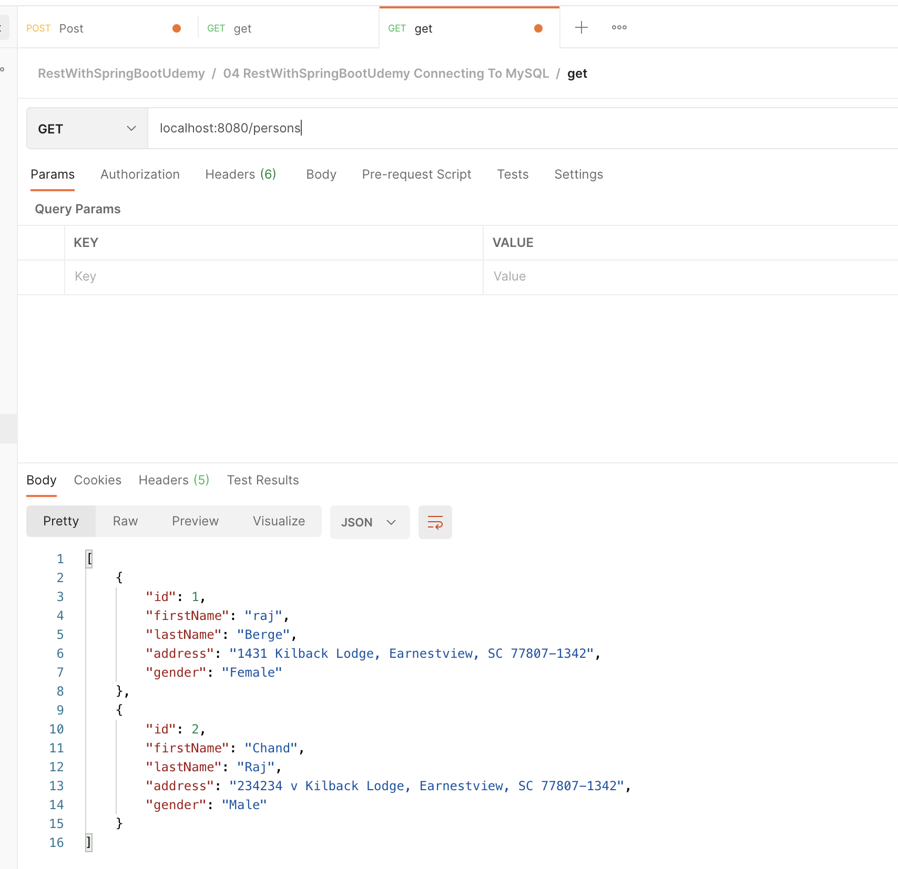
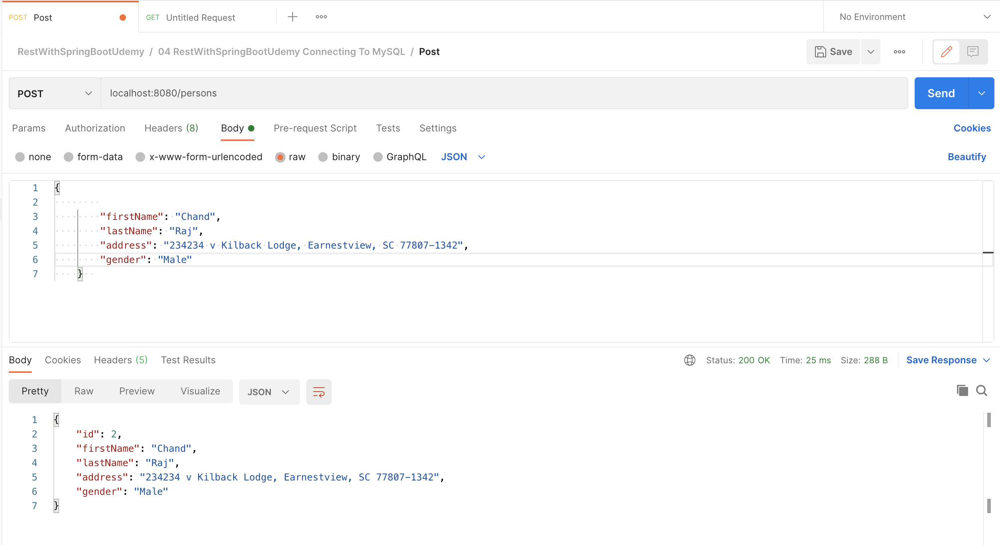
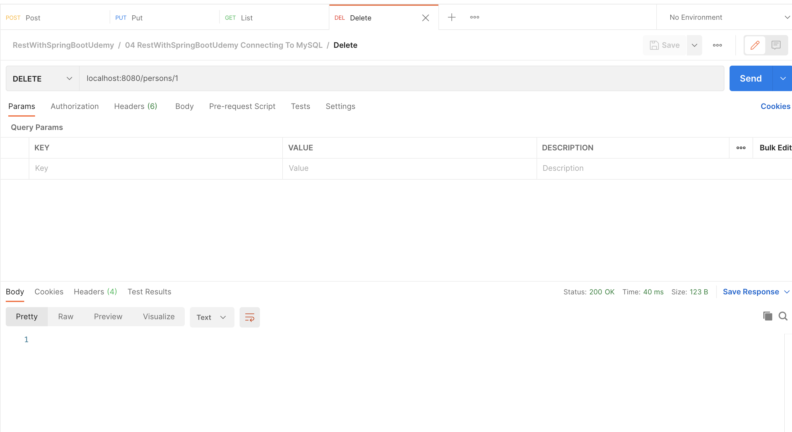

### Dozer
**Dozer** is a **Java Bean to Java Bean mapper** that recursively copies data from one object to another, attribute by attribute.

The library not only supports mapping between attribute names of Java Beans, but also **automatically converts between types** – if they're different.

Most conversion scenarios are supported out of the box, but Dozer also allows you to specify custom conversions via XML.

This is the most basic mapping one can do with Dozer:

```java
public class Source {
private String name;
private int age;

    public Source() {}

    public Source(String name, int age) {
        this.name = name;
        this.age = age;
    }
    
    // standard getters and setters
}
```

Then our destination file, Dest.java:
```java
public class Dest {
private String name;
private int age;

    public Dest() {}

    public Dest(String name, int age) {
        this.name = name;
        this.age = age;
    }
    
    // standard getters and setters
}
```
```
DozerBeanMapper mapper;

@Before
public void before() throws Exception {
mapper = new DozerBeanMapper();
}

```

Now, let's run our first test to confirm that when we create a Source object, we can map it directly onto a Dest object:
```
@Test
public void givenSourceObjectAndDestClass_whenMapsSameNameFieldsCorrectly_
thenCorrect() {
Source source = new Source("Baeldung", 10);
Dest dest = mapper.map(source, Dest.class);

    assertEquals(dest.getName(), "Baeldung");
    assertEquals(dest.getAge(), 10);
}
```
--------------

## Test Code

- [Get] single person
   - localhost:8080/persons/1
     

- [Get] List of persons
   - localhost:8080/persons
     
- [Post] person
    - localhost:8080/persons
      
    ``` 
   {
        "id": 3,
        "firstName": "raj",
        "lastName": "Berge",
        "address": "1431 Kilback Lodge, Earnestview, SC 77807-1342",
        "gender": "Female"
    }  
  ```

- [Put] person
    - localhost:8080/persons
      
 ``` 
   {
        "id": 3,
        "firstName": "raj",
        "lastName": "Berge",
        "address": "1431 Kilback Lodge, Earnestview, SC 77807-1342",
        "gender": "Female"
    }  
  ```

- [Delete] person
    - localhost:8080/persons
      